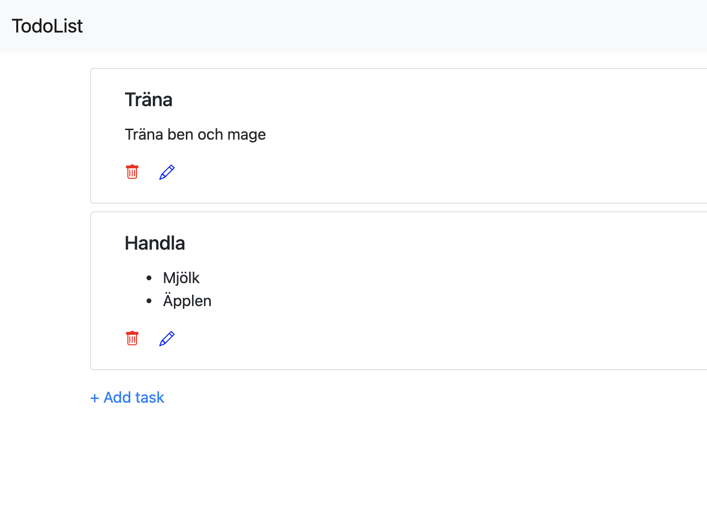

## Todo Application

Basic Todo application with login and registration of users. Possibility to store Regular tasks with title and message or Shopping task that represents a shoppinglist.

The app is created with Symfony.

### About the project
This project is created as part of the university course "Object Oriented Web Technologies" at Blekinge Tekniska Högskola.

### Installation
To install the app from this repo start by cloning the repository using git with:

    git clone https://github.com/RobIsr/todo.git

Make sure to hav a webserver installed and configured to run the app, for example [XAMPP](https://www.apachefriends.org/index.html "XAMPP"). Place the application folder wher it can be reached by the webserver.

To install the application use [Make](https://www.gnu.org/software/make/ "Make") with the following command:

    make install

This will ensure that the application is installed and also that a database will be created and configured.

### Usage

When the application is run the user is directed to the login screen if not alreade logged int. Atuhentication is managed with Symfonys Security Bundle.
 

If no account, the user can press the register link on the login page and get redirected to the registerpage. The user will be automatically logged in after successful registration.

When the user is logged in the main page will presented that contains a list with todo items loaded from database. The database is a sqlite database managed with Doctrine ORM.

New todo items can be added by pressing the "Add Task" button. When this is done the use will be redirected to the Add Task page. Here the user can select between adding a PlainTask or a Shopping Task. The PlainTask is just a simple task with a title and a message.

The ShoppingTask contains a title and a list of products. This item represents a shopping list. The user can add as many shopping items that he or she wishes by klicking the + sign. Each item can also be removed by clicking the - sign.

